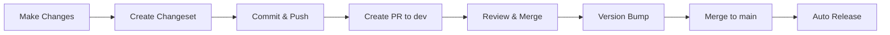

# Changeset Quick Reference

## Quick Commands

```bash
# Add a changeset for your changes
pnpm changeset

# Check what will be versioned
pnpm changeset:status

# Apply version bumps (maintainers only)
pnpm version

# Build and publish (maintainers only)
pnpm release
```

## When to Use Each Bump Type

### Patch (0.0.X) - Bug Fixes
- 🐛 Bug fixes
- 📝 Documentation
- 🎨 Style/formatting
- ♻️ Refactoring (no API change)
- ⚡ Performance (no breaking change)

**Example:**
```
🦋  Summary: Fix authentication token expiry bug
🦋  Bump: patch
```

### Minor (0.X.0) - New Features
- ✨ New features
- 🔥 Deprecations
- 🚀 Enhancements
- 📦 New optional parameters

**Example:**
```
🦋  Summary: Add user profile image upload endpoint
🦋  Bump: minor
```

### Major (X.0.0) - Breaking Changes
- 💥 Breaking API changes
- ❌ Removed features
- 🔄 Changed behavior
- ⚠️ Required parameter changes

**Example:**
```
🦋  Summary: Replace REST auth with OAuth2 (BREAKING)
🦋  Bump: major
```

## Changeset Flow



## Example Changeset File

```markdown
---
"api": minor
---

Add WebSocket support for real-time notifications

- New `/ws` endpoint for WebSocket connections
- Real-time event streaming
- Connection management utilities
```

## Commit Message Examples

With `pnpm commit`:

```bash
# Feature
feat(api): add user search endpoint

# Bug fix
fix(api): resolve JWT validation error

# Breaking change
feat(api)!: redesign authentication API

BREAKING CHANGE: Replace /auth/login with OAuth2
```

## PR Workflow

1. **Create feature branch from `dev`**
   ```bash
   git checkout dev && git pull
   git checkout -b feat/my-feature
   ```

2. **Make changes and commit**
   ```bash
   git add .
   pnpm commit
   ```

3. **Add changeset**
   ```bash
   pnpm changeset
   git add .changeset
   git commit -m "chore: add changeset"
   ```

4. **Push and create PR**
   ```bash
   git push -u origin feat/my-feature
   ```

5. **After merge to dev → version bump**
   ```bash
   pnpm version
   git commit -am "chore: version packages"
   ```

6. **Merge to main → auto-release**

## Tips

✅ **DO**
- Create changesets for user-facing changes
- Write clear, descriptive summaries
- One changeset per logical change
- Review generated CHANGELOGs

❌ **DON'T**
- Skip changesets for features/fixes
- Bundle multiple features in one changeset
- Forget to commit the changeset file
- Edit CHANGELOGs manually

## Need Help?

- 📖 [Full Documentation](../VERSIONING.md)
- 🔗 [Changesets Docs](https://github.com/changesets/changesets)
- 🔗 [Semantic Versioning](https://semver.org/)

